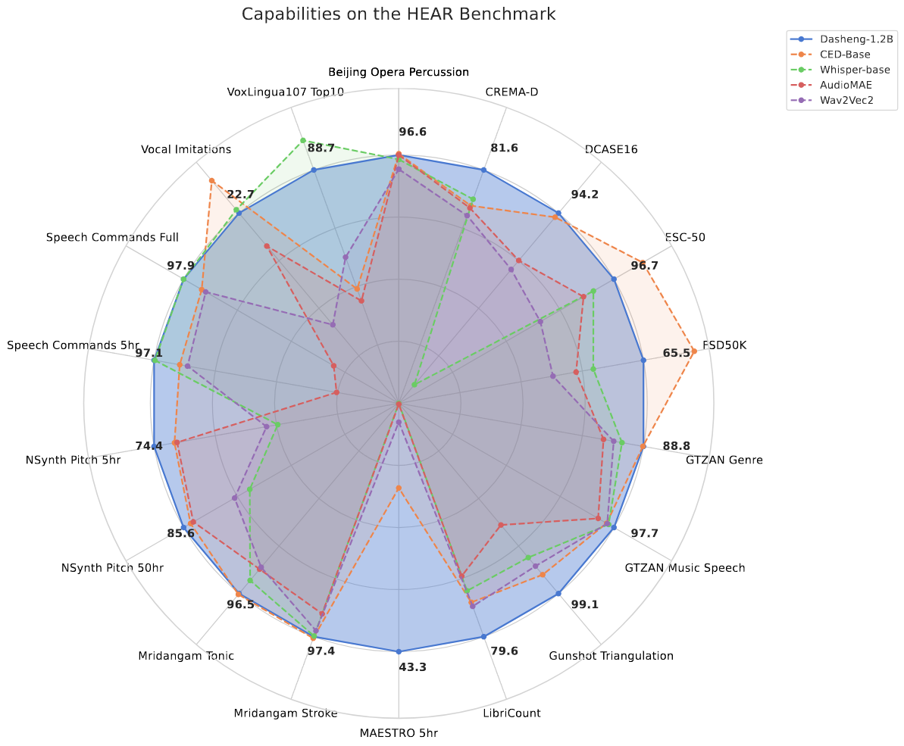

# Pretrained Dasheng on 🤗 Hugging Face

[](https://arxiv.org/abs/2406.xxxxx)
[](https://huggingface.co/mispeech/dasheng-base)
[](https://huggingface.co/mispeech/dasheng-0.6B)
[](https://huggingface.co/mispeech/dasheng-1.2B)
[](https://black.readthedocs.io/en/stable/)
[](https://www.apache.org/licenses/LICENSE-2.0)

Dasheng (**D**eep **A**udio-**S**ignal **H**olistic **E**mbeddi**ng**s), or “大声” ("great sound"), is a general-purpose audio encoder trained on a large-scale self-supervised learning task. Dasheng is designed to capture rich audio information across various domains, including speech, music, and environmental sounds. The model is trained on 272,356 hours of diverse audio data with 1.2 billion parameters, and exhibits significant performance gains on the [HEAR benchmark](https://hearbenchmark.com/). Dasheng outperforms previous works on CREMA-D, LibriCount, Speech Commands, VoxLingua, and competes well in music and environmental sound classification tasks.



## Usage

### Install

```bash
pip install git+https://github.com/jimbozhang/hf_transformers_custom_model_dasheng.git
```

### Inference

```python
>>> model_name = "mispeech/dasheng-base"  # or "mispeech/dasheng-0.6B", "mispeech/dasheng-1.2B"

>>> from dasheng_model.feature_extraction_dasheng import DashengFeatureExtractor
>>> from dasheng_model.modeling_dasheng import DashengModel

>>> feature_extractor = DashengFeatureExtractor.from_pretrained(model_name)
>>> model = DashengModel.from_pretrained(model_name, outputdim=None)  # no linear output layer if `outputdim` is `None`

>>> import torchaudio
>>> audio, sampling_rate = torchaudio.load("resources/JeD5V5aaaoI_931_932.wav")
>>> assert sampling_rate == 16000
>>> audio.shape
torch.Size([1, 16000])   # mono audio of 1 second

>>> inputs = feature_extractor(audio, sampling_rate=sampling_rate, return_tensors="pt")
>>> inputs.input_values.shape
torch.Size([1, 64, 101])   # 64 mel-filterbanks, 101 frames

>>> import torch
>>> with torch.no_grad():
...     outputs = model(**inputs)

>>> outputs.hidden_states.shape
torch.Size([1, 25, 768])   # 25 T-F patches (patch size 64x4, no overlap), before mean-pooling

>>> outputs.logits.shape
torch.Size([1, 768])   # mean-pooled embedding (would be logits from a linear layer if `outputdim` was set)
```

### Fine-tuning

[](https://colab.research.google.com/github/jimbozhang/hf_transformers_custom_model_dasheng/blob/main/example_finetune_esc50.ipynb)

[`example_finetune_esc50.ipynb`](https://github.com/jimbozhang/hf_transformers_custom_model_dasheng/blob/main/example_finetune_esc50.ipynb) demonstrates how to train a linear head on the ESC-50 dataset with the Dasheng encoder frozen.

## Citation

If you find Dasheng useful in your research, please consider citing the following paper:

```bibtex
@inproceedings{dinkel2023scaling,
  title={Scaling up masked audio encoder learning for general audio classification},
  author={Dinkel, Heinrich and Yan, Zhiyong and Wang, Yongqing and Zhang, Junbo and Wang, Yujun and Wang, Bin},
  booktitle={Interspeech 2024},
  year={2024}
}
```
